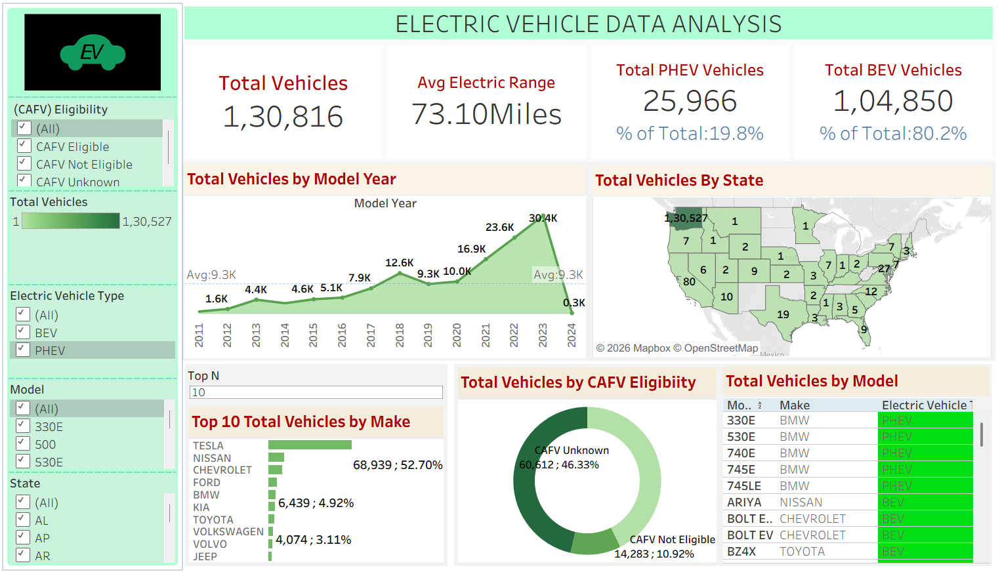

# Electric Vehicle Population Analysis Dashboard

## Overview

This Tableau dashboard analyzes electric vehicle adoption trends across different states, manufacturers, model years, and vehicle types.

## Objectives

- Study EV adoption patterns.
- Compare Battery Electric Vehicles (BEV) and Plug-in Hybrid Electric Vehicles (PHEV).
- Analyze vehicle distribution by geography and manufacturer.
- Evaluate electric range performance.

## Dashboard Features

- Total Vehicles
- Total BEV Vehicles
- Total PHEV Vehicles
- Average Electric Range
- Vehicles by State
- Vehicles by Model Year
- Top 10 Vehicle Manufacturers
- CAFV Eligibility Analysis
- Vehicles by Model

## Key Insights

- States leading EV adoption.
- Most popular EV manufacturers.
- Growth trends in electric vehicle registrations.
- Distribution between BEV and PHEV vehicles.
- Average electric range across the dataset.

## Tools Used

- Tableau
- Electric Vehicle Population Dataset

## Dashboard Preview

## Skills Demonstrated

- Data Visualization
- Trend Analysis
- Geographic Analysis
- Sustainability Analytics
- Business Intelligence

## Author

Yuvika
