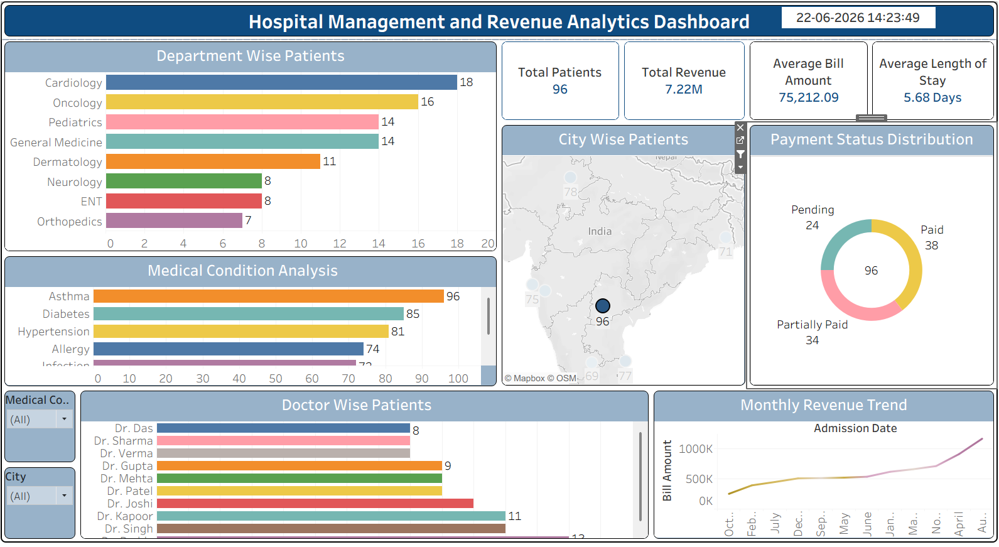

# Healthcare Analytics Dashboard

## Overview

This Tableau dashboard provides insights into hospital operations, patient distribution, revenue generation, and medical conditions.

## Objectives

- Monitor hospital performance.
- Analyze patient demographics and treatment patterns.
- Track revenue trends.
- Evaluate department-level performance.

## Dashboard Features

- Total Patients
- Total Revenue
- Average Bill Amount
- Average Length of Stay
- City-wise Patient Distribution
- Department-wise Analysis
- Doctor-wise Analysis
- Medical Condition Analysis
- Payment Status Distribution
- Monthly Revenue Trend

## Key Insights

- Departments serving the highest number of patients.
- Revenue generation trends over time.
- Common medical conditions among patients.
- Patient distribution by city.
- Payment status and billing analysis.

## Tools Used

- Tableau
- Healthcare Dataset

## Dashboard Preview

## Skills Demonstrated

- Healthcare Analytics
- Revenue Analysis
- Operational Reporting
- KPI Monitoring
- Dashboard Development

## Author

Yuvika
