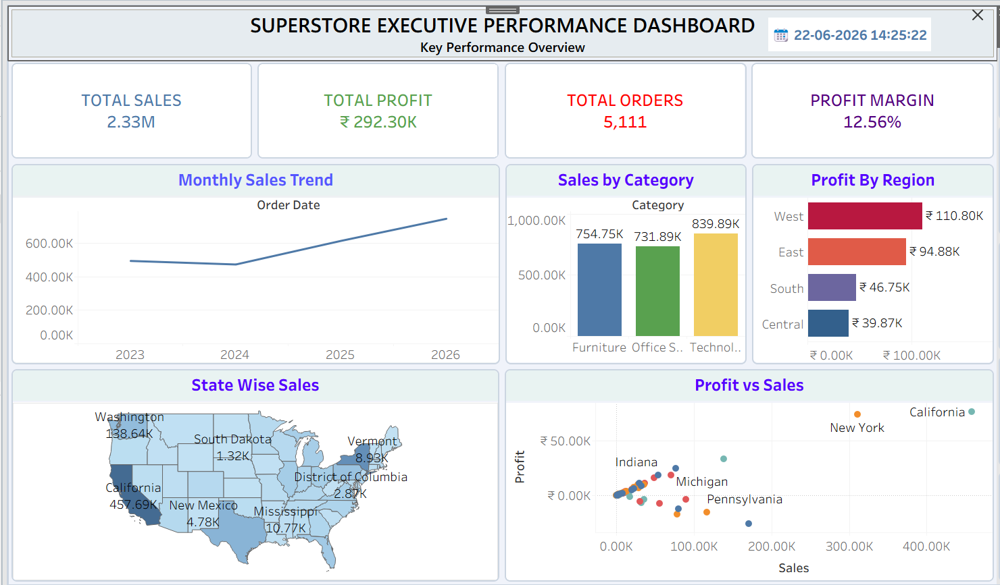
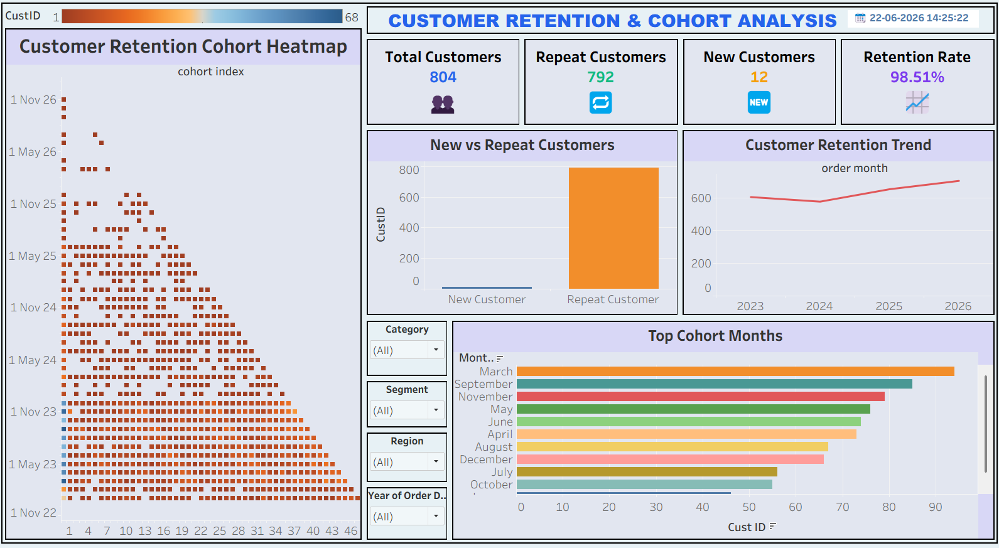
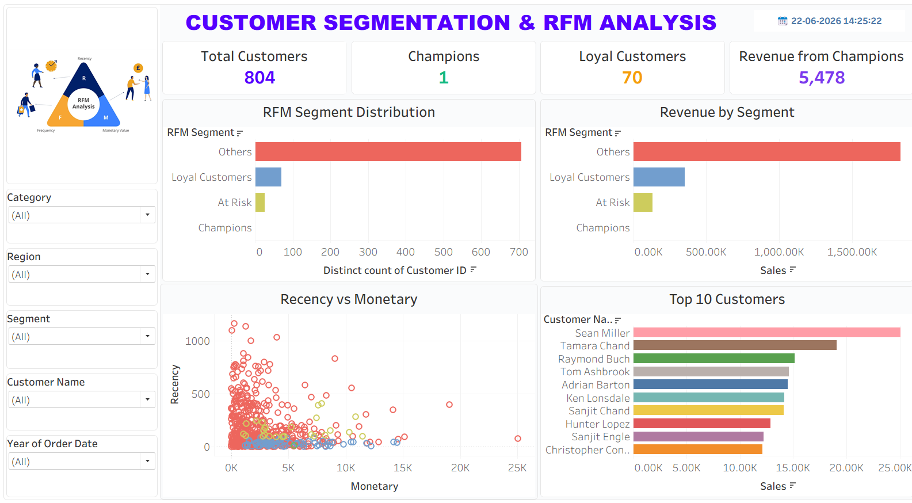

# Sales Analytics & Customer Segmentation Dashboard

## Overview

This Tableau dashboard focuses on customer retention, RFM segmentation, profitability analysis, and sales performance using Superstore sales data.

## Objectives

- Analyze customer purchasing behavior.
- Identify loyal and high-value customers.
- Track retention and repeat purchases.
- Evaluate profitability across customer segments.

## Dashboard Features

### Customer Analysis
- New vs Repeat Customers
- Loyal Customers
- Customer Retention Trend
- Cohort Analysis Heatmap

### RFM Analysis
- Recency Score
- Frequency Score
- Monetary Score
- RFM Segment Distribution

### Sales Performance
- Profit vs Sales Analysis
- Customer Segmentation
- Revenue Trends

## Key Insights

- Identification of high-value customer groups.
- Retention trends across different cohorts.
- Customer purchasing frequency patterns.
- Profitability analysis by customer segment.

## Tools Used

- Tableau
- Superstore Dataset

## Dashboard Preview

## Skills Demonstrated

- Customer Analytics
- RFM Segmentation
- Cohort Analysis
- Business Intelligence
- KPI Dashboard Design

## Author

Yuvika
